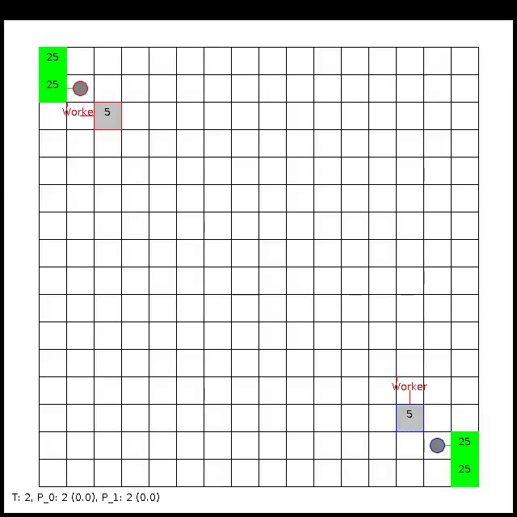
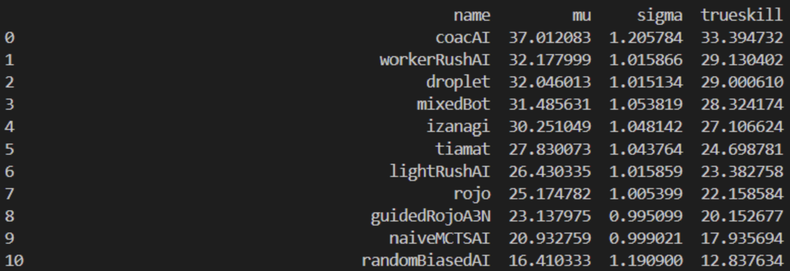

# Lightweight RL Agent in Full Length Real-Time Strategy Game
This is the repository associated with the DRL Final Project "Lightweight RL Agent in Full Length Real-Time
Strategy Game". It describes a scalable transformer architecture that is used to train an RL agent in the [Micro-RTS environment](https://github.com/Farama-Foundation/MicroRTS-Py), which has managed to outperform other RL agents in this variable action environment in terms of computational cost and episodic return. We provide installation and running instructions in the following sections. \
(Most sections are provided by the original repo).


<p align="center">
  
</p>

## Installation
Install dependencies with `pip install -r requirements.txt --extra-index-url https://download.pytorch.org/whl/cu113`. 

Note here that we assume a CUDA version 11.3 for GPU-based training. To disable the GPU usage or upgrade the dependency,
you will need to modify `requirements.txt`.

We additionally provide a dump file of our conda environment in `environment.yml`, you can also use it to setup the environment.

## Additional Setup
To apply the reshaped reward, you need to modify the Gym-microRTS package in your environment (we use conda here), you should be able to find the location of your vec_env.py file with `DRL_Final/find_package.py`, then modify the return value of `MicroRTSGridModeVecEnv.step_wait()` function, replace `return np.array(obs), reward @ self.reward_weight, done[:,0], infos` with `return np.array(obs), reward, done[:,0], infos`

## Training
During training, we use [Weights and Biases](https://wandb.ai/) to checkpoint and monitor the agent. 
We provide an example runs of the agent [here](https://wandb.ai/niklasz/public_var_action_transformers). 
You can enable wandb by using the flag `--prod-mode`. We have two trainable agents:
- `train_agent.py` -  a basic transformer network that can train on the 8x8 map.
- `train_embedded_agent.py` - same a `train_agent.py` but we use an embedding on the input to accommodate a larger 16x16 map.

Here is an example command to train the 8x8 agent:

`python train_agent.py new --exp-name my-training-run --map-size 8`

Where the full extent of input arguments can be seen with `train_agent.py new -h`. If using `wandb` this run will generate a `run-id`.
We can interrupt the training at any time and resume it again using this `run-id`:

`python train_agent.py resume --run-id <run-id>`

A similar set of commands applies to the 16x16 agent:

`python train_embedded_agent.py new --exp-name my-other-training-run --map-size 16`

`python train_embedded_agent.py resume --run-id <run-id>`

Again, there are many more run-time parameters to configure (`train_embedded_agent.py new -h`). The best known agent uses the default parameters.

## Evaluation
We evaluate against 13 AI opponents:

```python
all_ais = {
    "guidedRojoA3N": microrts_ai.guidedRojoA3N,
    "randomBiasedAI": microrts_ai.randomBiasedAI,
    "randomAI": microrts_ai.randomAI,
    "passiveAI": microrts_ai.passiveAI,
    "workerRushAI": microrts_ai.workerRushAI,
    "lightRushAI": microrts_ai.lightRushAI,
    "coacAI": microrts_ai.coacAI,
    "naiveMCTSAI": microrts_ai.naiveMCTSAI,
    "mixedBot": microrts_ai.mixedBot,
    "rojo": microrts_ai.rojo,
    "izanagi": microrts_ai.izanagi,
    "tiamat": microrts_ai.tiamat,
    "droplet": microrts_ai.droplet,
}
```

To run the evaluation on the 8x8 agent use:

`python evaluate_agent.py base --agent-model-path example_models/8x8/agent.pt --exp-name 8x8_evaluation --map-size 8 --num-eval-runs 100`

And similarly for the 16x16 agent:

`python evaluate_agent.py embedded --agent-model-path example_models/16x16/agent.pt --exp-name 16x16_evaluation --map-size 16 --num-eval-runs 100`

Where [example_models](example_models) contains the already trained models. If using your own model, set your own `--agent-model-path`. 
We also provide the generated output evaluation under [evaluation](evaluation).

## Modules
`DRL_Final/map_generator.py` and `DRL_Final/map_generator_test.py`: \
To use our custom map maker, modify `save_path` in `DRL_Final/map_generator.py` first, then modify `DRL_Final/map_generator_test.py` to design your own map according to the provided example.

`DRL_Final/observation_parser.py`: \
The module to parser input state for reward shaping. (already applied to both training script)

`DRL_Final/shape_reward.py`: \
The module to apply reshaped reward. (already applied to both training script)

`DRL_Final/partial_observation.py`: \
The module to apply partial observation masking. (not thoroughly tested)

## Models
Our trained models are located in `DRL_Final/latest_models`, the 16x16 models are still performing pretty badly though.
The expected skill of baseline agents in the `basesWorkers16x16` map is also provided below: \

